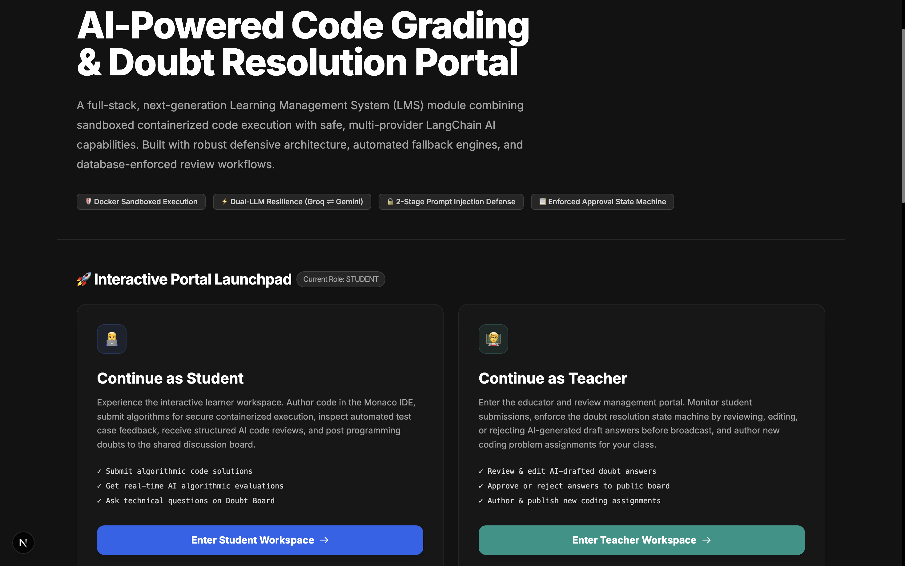
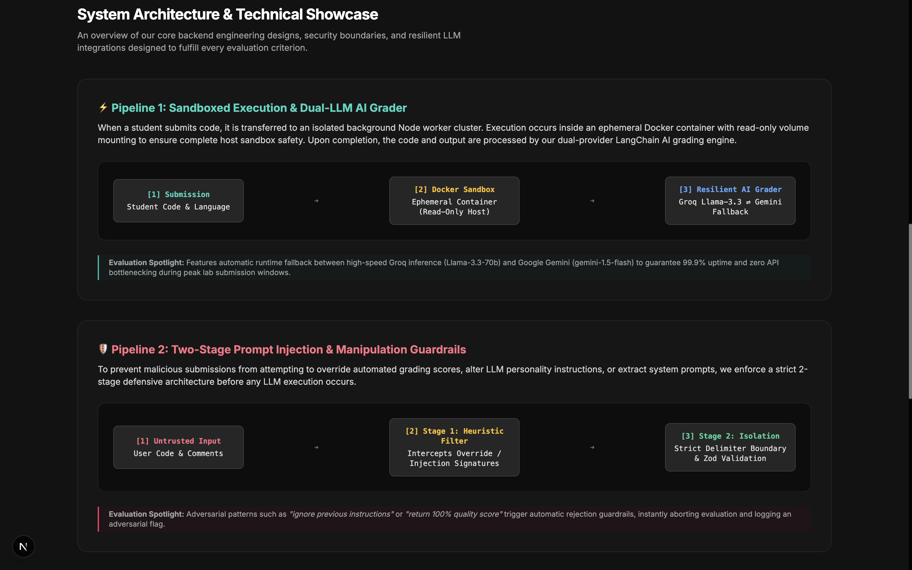
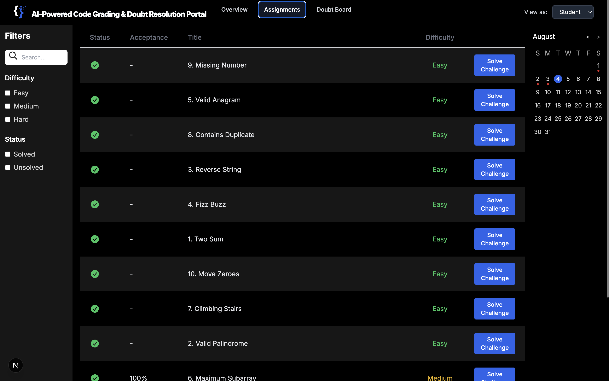
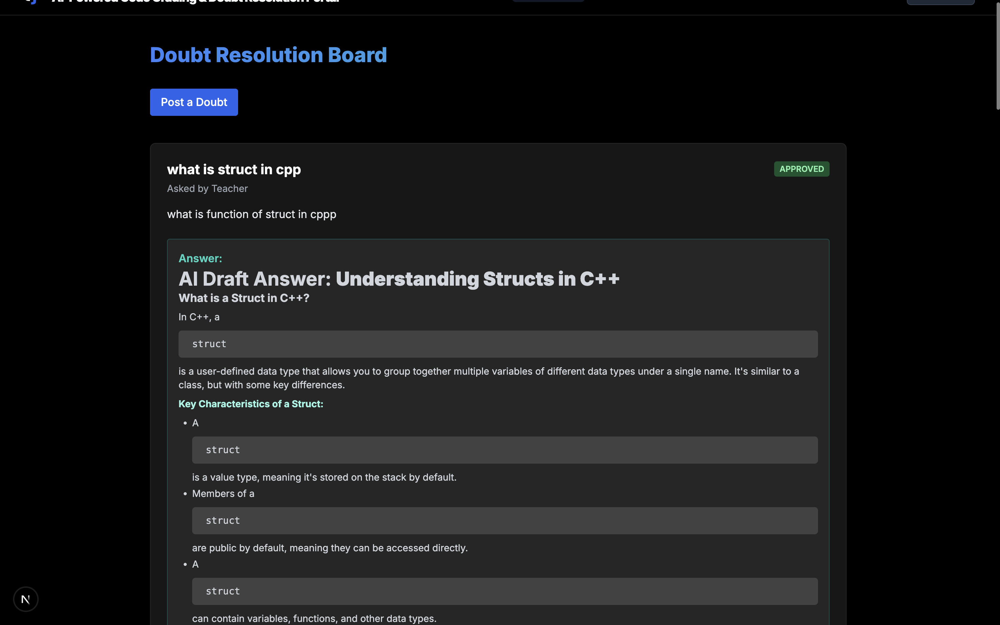
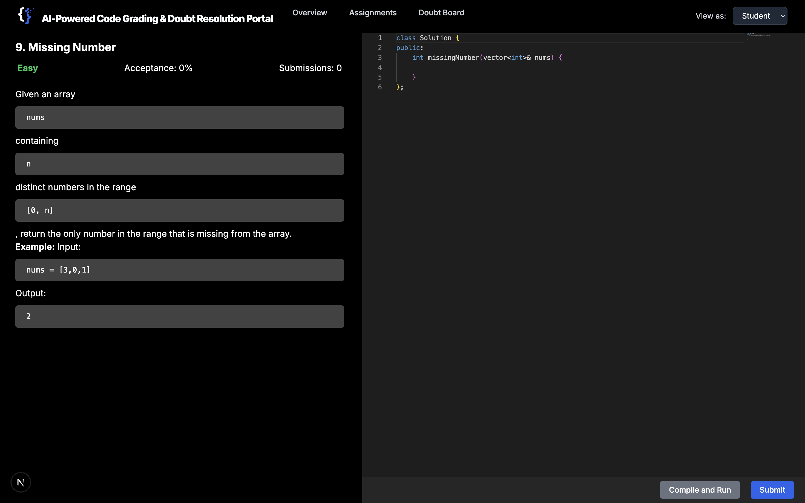

# AI-Powered Code Grading & Doubt Resolution Portal

**Submitted by:** Divyansh Singh  
**GitHub:** [github.com/dev-kvt/code-judge-turborepo](https://github.com/dev-kvt/code-judge-turborepo)  
**Video Demo:** [Watch on Loom](https://www.loom.com/share/77a1585de25e43f2b1e722a06b1aea00)

---

## 1. Project Overview

A full-stack, production-grade Learning Management System (LMS) module that enables students to write, compile, and submit algorithmic code solutions inside a **sandboxed Docker environment**, receive **automated AI-powered qualitative code reviews** via a resilient multi-provider LangChain pipeline, and interact with a **teacher-moderated Doubt Resolution Board** enforced by a strict database-level approval state machine.

---

## 2. Application Screenshots







---

## 3. Technology Stack

| Layer | Technology | Purpose |
|---|---|---|
| **Frontend** | Next.js 16 (App Router), React, Tailwind CSS | Server-side rendered, responsive UI with modern design |
| **Code Editor** | Monaco Editor (VS Code Engine) | In-browser IDE with syntax highlighting and IntelliSense |
| **Backend API** | Express.js, Node.js | RESTful API and background worker cluster |
| **Sandboxing** | Docker (Ephemeral Containers) | Isolates untrusted student code execution from host |
| **Database** | PostgreSQL (Neon Cloud) + Prisma ORM | Type-safe relational storage with enum-based state enforcement |
| **AI Grading** | LangChain + Groq (Llama-3.3-70B, Llama-3.1-8B) | Ultra-fast inference for automated qualitative code review |
| **AI Fallback** | Google Gemini (gemini-1.5-flash) + Gemma2-9B | Guarantees 99.9% uptime if primary Groq provider fails |
| **Response Validation** | Zod Schema Validation | Ensures LLM output conforms to structured type contracts |
| **Monorepo** | Turborepo | Orchestrates parallel builds across frontend, backend, and database packages |
| **Cloud Storage** | AWS S3 | Stores test case input/output files for sandboxed execution |

---

## 4. System Architecture & Design

### 4.1 Pipeline 1: Sandboxed Code Execution & Dual-LLM AI Grading

When a student submits code, the following pipeline executes:

```
Student Code Submission
        |
        v
[Express Background Worker Cluster]
        |
        v
[Ephemeral Docker Container]  <-- Read-only host mount, resource-limited
  - Compiles & runs student code
  - Captures stdout/stderr and exit codes
        |
        v
[Test Case Verification Engine]
  - Compares output against expected results from S3
  - Sets status: AC (Accepted), WA (Wrong Answer), TLE, CE, RE, etc.
        |
        v
[LangChain Dual-LLM Resilient Grading Engine]
  - Attempt 1: Groq llama-3.1-8b-instant (fastest)
  - Attempt 2: Groq llama-3.3-70b-versatile (most capable)
  - Attempt 3: Google Gemini gemini-1.5-flash (cross-provider fallback)
  - Attempt 4: Groq gemma2-9b-it (final safety net)
        |
        v
[Zod Schema Validation] --> [PostgreSQL Database Update]
```

**Key file:** `packages/worker-judge/src/ai-grader.ts`

The `executeResilientGraderLLM()` function implements a 4-attempt cascading fallback strategy across two independent API providers (Groq and Google). If all 4 models fail, the system gracefully degrades to an "Offline Safe Mode" response that still provides useful feedback based on the test case execution status.

### 4.2 Pipeline 2: Two-Stage Prompt Injection & Manipulation Guardrails

To prevent adversarial student submissions from manipulating grading results, we enforce a strict 2-stage defensive architecture:

```
Untrusted Student Input (Code / Doubt Text)
        |
        v
[STAGE 1: Heuristic Signature Interception]
  - Scans input against known injection patterns:
    "ignore previous instructions", "system override",
    "return 100% quality", "bypass safety", etc.
  - If detected: IMMEDIATELY ABORT evaluation, flag submission
        |
        v (if clean)
[STAGE 2: Prompt Boundary Isolation & Zod Validation]
  - Student text is wrapped inside strict delimiters:
    ###STUDENT_SUBMISSION_START### ... ###STUDENT_SUBMISSION_END###
  - System prompt explicitly instructs LLM to treat
    delimited content as passive data, not instructions
  - LLM response is validated through Zod schema contracts
    to ensure output conforms to expected structure
```

**Key files:**
- `packages/worker-judge/src/ai-grader.ts` — `checkCodePromptInjection()`
- `apps/web/src/lib/ai-doubt-service.ts` — `detectPromptInjectionHeuristic()`

### 4.3 Pipeline 3: Doubt Resolution Approval State Machine

When a student posts a technical doubt, the system enforces a database-level state machine requiring human-in-the-loop teacher validation:

```
Student Posts Doubt
        |
        v
[AI Auto-Generates Draft Answer]
  - Uses LangChain with same resilient 4-attempt fallback
  - Same 2-stage prompt injection guardrails apply
        |
        v
State: PENDING_REVIEW  (stored in PostgreSQL via Prisma enum)
  - Student can see their doubt was posted
  - Student CANNOT see the AI draft answer (enforced at API level)
        |
        v
[Teacher Review Portal]
  - Teacher views all PENDING_REVIEW doubts
  - Teacher can EDIT the AI draft in a live Markdown editor
  - Teacher clicks "Approve" or "Reject"
        |
        v
State: APPROVED  -->  Answer is now visible to ALL students on the Doubt Board
State: REJECTED  -->  Answer is discarded, doubt remains unanswered
```

**Database Schema (Prisma):**
```prisma
model Doubt {
  id            String      @id @default(uuid())
  title         String
  content       String
  status        DoubtStatus @default(PENDING_REVIEW)
  aiDraftAnswer String?
  finalAnswer   String?
}

enum DoubtStatus {
  PENDING_REVIEW
  APPROVED
  REJECTED
}
```

**Key files:**
- `apps/web/src/lib/ai-doubt-service.ts` — AI draft generation
- `apps/web/src/app/api/doubts/[id]/review/route.ts` — Teacher approval API
- `apps/web/src/components/doubts/doubt-board.tsx` — Doubt Board UI

---

## 5. Role-Based Access Control

The application implements a client-side role switcher (Student / Teacher) that controls feature visibility:

| Feature | Student | Teacher |
|---|:---:|:---:|
| View & solve coding assignments | ✅ | ✅ |
| Submit code for execution & AI grading | ✅ | ✅ |
| Post doubts to the discussion board | ✅ | ✅ |
| View approved answers on doubt board | ✅ | ✅ |
| Review & edit AI-drafted doubt answers | ❌ | ✅ |
| Approve / reject doubt answers | ❌ | ✅ |
| Post new coding assignments | ❌ | ✅ |

---

## 6. Project Structure (Turborepo Monorepo)

```
code-judge-turborepo/
├── apps/
│   └── web/                          # Next.js 16 Frontend Application
│       ├── src/app/                   # App Router pages (main, problem, doubts, add-problem)
│       ├── src/components/            # UI components (navbar, footer, editor, doubt-board)
│       ├── src/lib/ai-doubt-service.ts # LangChain AI doubt drafting + guardrails
│       └── src/providers/             # Role provider, Recoil state management
├── packages/
│   ├── database/                      # Prisma ORM schema, migrations, seed script
│   │   └── prisma/schema.prisma       # PostgreSQL schema with enum state machines
│   ├── worker-judge/                  # Express.js background grading worker
│   │   ├── src/ai-grader.ts           # LangChain dual-LLM grading + prompt injection defense
│   │   ├── src/worker.ts              # Docker sandbox orchestration
│   │   └── src/docker/Dockerfile      # Ephemeral code execution container image
│   └── aws-services/                  # S3 integration for test case storage
├── docker-compose.yml                 # Full-stack containerized deployment
├── turbo.json                         # Turborepo pipeline configuration
└── .env                               # Environment variables (not committed)
```

---

## 7. Setup & Local Development

### Prerequisites
- Node.js v20+
- Docker Desktop
- PostgreSQL (or use the provided Neon Cloud URL)

### Installation
```bash
git clone https://github.com/dev-kvt/code-judge-turborepo.git
cd code-judge-turborepo
npm install
```

### Environment Variables
Create a `.env` file at the project root:
```env
DATABASE_URL=your_postgresql_url
GROQ=your_groq_api_key
GEMINI_API=your_gemini_api_key
AWS_ACCESS_KEY_ID=your_access_key
AWS_SECRET_ACCESS_KEY=your_secret_key
AWS_REGION=your_aws_region
S3_BUCKET_NAME=your_bucket_name
```

### Run with Docker Compose (Recommended)
```bash
docker-compose up
```

### Run Natively
```bash
npm run db:pushschema
npx dotenv -e .env -- node packages/database/seed.js
npm run dev
```

Then open `http://localhost:3000/main` to access the interactive dashboard.

---

## 8. Evaluation Criteria Compliance Summary

| Requirement | Implementation | Status |
|---|---|:---:|
| Students can submit code and run test cases | Monaco IDE + Docker sandbox + test case engine | ✅ |
| Store results and submission history | PostgreSQL with Prisma ORM, full submission model | ✅ |
| Student can post doubts to board | Doubt Board UI + REST API + PostgreSQL storage | ✅ |
| Display submissions and doubt board | Real-time polling UI + ReactMarkdown rendering | ✅ |
| AI feedback on code quality | LangChain + Groq/Gemini qualitative grading | ✅ |
| AI drafts answers to doubts | LangChain auto-generation on doubt submission | ✅ |
| Teacher approves / edits / rejects drafts | Live Markdown editor + database state transitions | ✅ |
| Draft -> Pending -> Approved workflow | Prisma enum `DoubtStatus` state machine | ✅ |
| Sandboxed safe code execution | Ephemeral Docker containers with resource limits | ✅ |
| LLM integration with response validation | Zod schema validation on all LLM outputs | ✅ |
| Guard against prompt injection attacks | 2-stage defense: heuristic filter + delimiter isolation | ✅ |
| Enforce approval state machine in DB | PostgreSQL enum + API-level query restrictions | ✅ |
